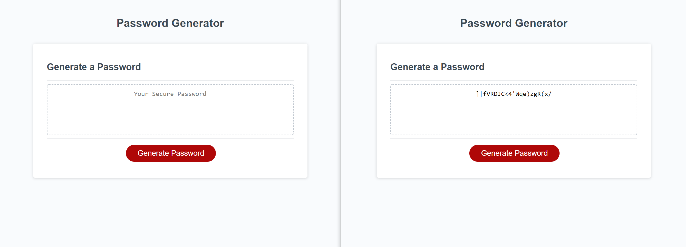

# Password Generator 

## Description

This application allows you to generate a random password based on your preferences. How long would you like your password to be? Would you like your new password to include lowercase and or uppercase letters? What about numbers? Lastly, would you like special characters? 

Then your unique password will be displayed on the screen. That can be used to keep your accounts secure. 

I have tried to structure the code as neatly as possible with comments that help explain some sections. Achieving this application with basic knowledge of Javascript and less than 100 lines of code.

## Usage

Try it out yourself. Link to the final product: [Password Generator](https://andrew60199.github.io/password-generator-01/)

Above is a side by side comparison of the applications opening interface and a randomly generated password after completing the prompts.

## Licences

Refer to the 'LICENSE' file 